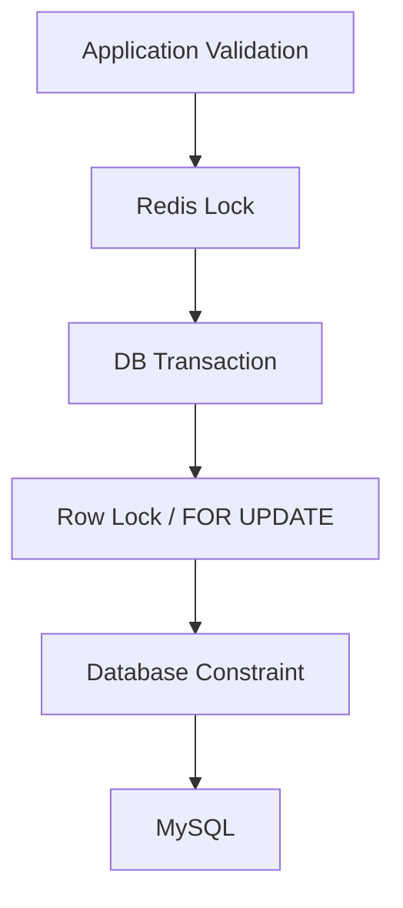

# Multi-Tenant Loyalty & Point API Platform

---

## 1. Executive Summary / 執行摘要

本專案是一套專注於交易一致性、租戶隔離與可擴展性的會員忠誠度系統核心。不同於一般的 CRUD 會員系統，本專案從第一天開始就將高併發場景下的資料一致性作為核心設計目標，通過雙層鎖定、資料庫優先冪等性、事務性 Outbox 等技術，解決真實世界中多系統同時存取同一會員點數時的複雜一致性問題。本專案的工程重點在於處理真實世界的併發交易、資料一致性與多租戶架構挑戰，而非單純的 CRUD 應用程式。

---

## 2. Why This Project Exists / 為什麼做這個專案

傳統的會員忠誠度系統通常專注於功能完整性，卻忽略了高併發場景下的交易一致性挑戰。當單一會員的點數帳戶同時收到來自網站、手機 App、POS 系統、電商平台等多個來源的交易請求時，很容易出現餘額計算錯誤、重複扣點、超發等問題。本專案的核心目標是構建一個能夠在真實世界的高併發場景下，依然能夠保證核心業務不變量（如點數餘額永不為負）的可靠系統。

---

## 3. What Makes This Project Different? / 這個專案有什麼不同？

不同於一般的 CRUD 會員系統，本專案從第一天開始就將交易一致性作為核心設計目標：
- 雙層鎖定策略（Redis Lock + DB Row Lock）處理併發競爭
- 資料庫優先的冪等性設計，不依賴 Redis 作為一致性源
- 完整的併發測試驗證，使用真實的多進程模型驗證系統穩定性
- 嚴格的租戶隔離機制，從應用層到資料庫層的多層級防護
- Transactional Outbox 模式確保領域事件的可靠投遞
- 狀態模式與策略模式的輕量級實踐，在擴展性與複雜度之間取得平衡

---

## 4. Architecture Highlights / 架構亮點

本專案的核心架構能力包括：
- Multi-Tenant Shared Database Architecture
- Transactional Point Ledger
- PointLot FIFO Consumption
- Redis Lock + DB Row Lock
- Database-First Idempotency
- Domain Event + Transactional Outbox
- Real Process-level Concurrency Verification
- Modular Monolith Architecture

---

## 5. Core Modules / 核心模組

本專案採用 Modular Monolith 架構，核心模組包括：
- **Multi-Tenant 核心**：全域租戶解析與隔離機制，確保所有操作都在正確的租戶上下文內
- **Point Domain**：點數交易核心，實現完整的交易一致性保證
- **Coupon Domain**：優惠券系統，包含狀態機管理與核銷流程
- **Concurrency Control**：雙層鎖定與死鎖預防機制
- **Event Processing**：Transactional Outbox 與非同步事件處理
- **WebSocket 即時通知**：透過 Laravel Reverb 實現點數異動的即時推送

核心架構原則：資料庫是最終一致性源，所有其他服務（Redis、消息佇列）都只是優化層，即使外部依賴失效，核心業務不變量依然能夠被保證。

---

## 6. Domain Invariants / 領域不變量

### 6.1 Point Balance Invariant
```text
PointTransaction
    ↓
Business Ledger / Audit History

PointAccount.balance >= 0
PointLot.remaining_points >= 0

PointAccount.balance
↔
SUM(PointLot.remaining_points)
    ↓
Runtime Balance Invariant
```

說明：
- **PointTransaction**：不可變的交易 Ledger / audit history，是核心的事實來源
- **PointAccount**：目前可用餘額的 operational projection，不得負數
- **PointLot.remaining_points**：FIFO consumption state，不得負數
- `PointAccount.balance == SUM(PointLot.remaining_points)`：**runtime consistency invariant**，運行時必須永遠保持一致

保證機制包括：
- application validation
- conditional database update
- unsigned database column
- `lockForUpdate()`

### 6.2 Transaction Atomicity
以下操作必須在同一 DB transaction：
```text
PointAccount balance
PointLot consumption
PointTransaction
Outbox event
```

流程：
```text
DB::transaction()
↓
PointAccount lockForUpdate()
↓
balance update
↓
PointLot lockForUpdate()
↓
PointLot update
↓
PointTransaction
↓
Commit
```

### 6.3 Tenant Isolation Invariant
`tenant_id` 是 correctness / security boundary。

實現機制：
- TenantResolver
- BelongsToTenant
- Global Scope
- Middleware
- Policies
- Database Foreign Key
- Composite Unique Index

Super Admin 可以沒有固定 tenant context，跨租戶操作需明確指定 tenant context。

### 6.4 Idempotency Invariant
```text
UNIQUE (tenant_id, idempotency_key)
```

狀態機：
- processing
- completed
- failed

說明：
- database 是 correctness boundary
- Redis 只是 optimization / cache
- Redis 故障不能破壞 DB idempotency

### 6.5 FIFO Consumption Invariant
```php
->orderBy('earned_at', 'asc')
->orderBy('id', 'asc')
->lockForUpdate()
```

明確實現 PointLot FIFO 消費策略，保證先獲得的點數先被消耗。

---

## 7. Transaction & Consistency / 交易與一致性

本系統採用雙層鎖定策略來處理高併發場景下的一致性問題，Redis Lock 與 DB Lock 承擔完全不同的責任：

### 7.1 Redis Lock（應用層優化）
**負責**：
- 降低資料庫鎖爭用：讓多應用實例的併發請求先在 Redis 排隊
- 減少死鎖概率：提早序列化對同一客戶的操作
- 僅是優化層，不是 correctness boundary

Redis Lock 失敗時（例如 Redis 連接中斷、鎖等待超時），系統會拋出「系統繁忙」例外，避免在分佈式協調機制失效時繼續交易，確保只有在雙層鎖定都正常的情況下才執行點數操作。

### 7.2 Database Lock（最終正確性保證）
**負責**：
- 行級序列化：`lockForUpdate()` 確保同一時間只有一個交易能修改某行
- 避免 Lost Update：即使 Redis Lock 失效，資料庫層級的鎖依然能防止並發修改
- 死鎖自動重試：`DB::transaction($callback, 3)` 自動重試因死鎖失敗的交易（最多 3 次）

**完整流程**：
```text
Redis Lock (block 最多 10 秒)
↓
DB::transaction() (最多重試 3 次)
↓
PointAccount::lockForUpdate()
↓
依序鎖定需要修改的 PointLot
↓
執行所有更新
↓
Commit
```

### 7.3 Consistency Boundary


**責任邊界說明**：
- **Redis** = concurrency optimization / coordination（僅做併發優化與協調，非一致性源）
- **MySQL** = correctness boundary（最終正確性邊界）
- **Database transaction** = atomicity boundary（原子性邊界）
- **Database constraint** = final integrity guarantee（最終完整性保證）

---

## 8. Multi-Tenant Isolation / 多租戶隔離

租戶隔離是系統的安全性邊界，不是功能需求。本系統實現了多層級的防護：

```text
應用層級保護
├─ TenantResolver：解析當前請求的租戶上下文
├─ BelongsToTenant Trait：自動為租戶擁有的模型套用全域租戶範圍
├─ Policies：每個資源的授權檢查再次驗證租戶
└─ Middleware：請求進入時的租戶驗證
│
資料庫層級保護
├─ 所有表的 tenant_id 外鍵約束
└─ 唯一約束包含 tenant_id 防止跨租戶碰撞
```

### Super Admin 例外機制
只有超級管理員可以跳過全域租戶範圍，查看所有租戶的資料。這是唯一的例外，且在程式碼中明確標註，所有其他使用者都必須在租戶上下文內操作。

---

## 9. Concurrency Verification / 併發驗證

```text
Concurrency Correctness
≠
Performance Benchmark
≠
Load Test
```

### Real Process-level Verification Flow
```text
100 PHP Processes
↓
Redis Barrier
↓
Workers Ready
↓
Release
↓
Concurrent PointService
↓
Redis Lock
↓
DB Transaction
↓
PointAccount lockForUpdate()
↓
PointLot lockForUpdate()
↓
Commit
```

**Barrier 機制說明**：
- Barrier 是 Redis coordination mechanism，不是 correctness boundary
- `Redis::INCR` 用於 Worker ready 計數
- Parent 等待全部 Worker ready 後才 release
- Worker 在 release 後記錄 `microtime(true)`
- Parent 統計 `spread_ms`
- `spread_ms` 用於觀察 Worker 實際開始執行的時間分布，不作為固定 PASS/FAIL 門檻
- These measurements are execution-observation data, not a formal throughput or latency benchmark.

### Verified Results
| Scenario                  | Workers | Success | Spread   |
|---------------------------|--------:|--------:|---------:|
| Concurrent Earn           |     100 |     100 | 73.04 ms |
| Concurrent Redeem         |     100 |     100 | 73.35 ms |
| Oversubscription Redeem   |     100 |      50 | 86.92 ms |

Result:  
3 tests passed  
29 assertions  
100 independent PHP processes

---

## 10. Idempotency / 冪等性

本系統的冪等性策略遵循「資料庫是唯一權威」的核心原則，Redis 僅用於快取優化。

### 10.1 核心保證
- Database unique constraint guarantees a single idempotency record per `(tenant_id, idempotency_key)`, while the idempotency state machine controls request replay and business-effect handling.
- **狀態機**：
  - `processing`：請求正在處理中
  - `completed`：請求成功完成
  - `failed`：請求處理失敗，可重試
- **陳舊清理**：定時任務清理 7 天前的 completed 記錄，以及 5 分鐘以上的 stale processing 記錄

### 10.2 為什麼不只用 Redis？
- Redis 可能會丟失數據（持久化故障、內存淘汰）
- Redis 故障轉移期間可能出現一致性窗口
- 資料庫的唯一約束是最可靠的防線，即使所有上層機制都失效，依然能防止重複執行

---

## 11. Architecture Decisions / 架構決策

所有架構決策都記錄在 `/docs/adr/`，以下是核心決策摘要：

| ADR     | Decision                          | Status          |
|---------|-----------------------------------|-----------------|
| ADR-001 | Modular Monolith                  | ✅ Accepted     |
| ADR-002 | Shared Database Multi-Tenancy     | ✅ Accepted     |
| ADR-003 | Redis + DB Transaction + Row Lock | ✅ Implemented  |
| ADR-004 | JWT Authentication                | ✅ Implemented  |
| ADR-005 | No Microservices Yet              | ✅ Accepted     |
| ADR-006 | Idempotency Strategy              | ✅ Implemented  |
| ADR-007 | Point Lot & Expiration Strategy   | ✅ Implemented  |
| ADR-008 | Coupon System                     | ✅ Implemented  |
| ADR-009 | Coupon / Reward API Boundary      | ✅ Implemented  |
| ADR-010 | Membership Tier System            | ✅ Implemented  |
| ADR-011 | Campaign Rule Engine              | ✅ Implemented  |
| ADR-012 | Audit Logging System              | ✅ Implemented  |
| ADR-013 | Outbox Pattern for Domain Events  | ✅ Implemented  |

---

## 12. Design Patterns / 設計模式

### 12.1 Strategy Pattern
針對點數賺取規則（Earn Rules）的多樣性與演變性，我們實作了 Strategy Pattern 來分離「點數計算邏輯」與「交易一致性流程」：

```text
PointService
    ↓
PointEarnStrategy
    ↓
Calculate Points
    ↓
PointService
    ↓
DB Transaction
    ↓
PointAccount / PointLot / PointTransaction
    ↓
Domain Event / Outbox
```

**責任劃分**：
- **Strategy 負責**：算多少點
- **PointService 負責**：如何安全地完成 Point Transaction

**目前實作的 Strategy**：
- `PurchaseEarnStrategy`：依消費金額及會員等級倍率計算點數
- `CampaignEarnStrategy`：依活動倍率及 bonus points 計算點數
- `ReferralEarnStrategy`：推薦獎勵點數
- `VipExclusiveEarnStrategy`：VIP 專屬點數計算

### 12.2 State Pattern
Coupon 本身具有明確的狀態集合與狀態轉換規則，因此將狀態轉換責任從 Coupon Service 中抽離，避免狀態判斷隨業務增加而持續累積。

**目前實際存在的 Coupon status**：
```text
available
used
expired
cancelled
```

**目前實際使用的合法 transition**：
```text
available → used
```

**狀態轉換流程**：
```text
available
    ↓ redeem()
used
```

### 12.3 Evaluated but Not Implemented
- Chain of Responsibility：目前 Point Domain 尚不存在足夠獨立、可組合的 eligibility rules，因此不導入。

> Pattern 是 Problem Driven，而不是 Pattern Driven。如果目前 Domain 沒有足夠複雜度，就不要為了展示 Design Pattern 而增加 abstraction。

---

## 13. Event / Outbox / WebSocket / 事件、出匣與即時通訊

### 13.1 Domain Event / 領域事件
PointService 定義了五種核心 Domain Event，用於表達所有影響點數餘額的業務行為：
- **PointEarned**：取得點數
- **PointRedeemed**：兌換/消耗點數
- **PointRefunded**：退款點數
- **PointAdjusted**：人工或系統調整點數
- **PointExpired**：點數到期

### 13.2 Transactional Outbox / 交易性出匣
Business data + OutboxEvent：
> same DB transaction

確保 business state 與 event record 一致。

**Runtime**：
```text
Domain/Business Transaction
→ outbox_events
→ Scheduler
→ outbox:process-pending
→ ProcessOutboxEvent
→ Redis Queue (outbox)
→ Queue Worker
→ Domain Event
→ Listener
```

### 13.3 WebSocket / 即時通訊
WebSocket 是 post-commit asynchronous notification。

#### Architecture
```text
PointService
→ DB Transaction Commit
→ DB::afterCommit()
→ PointsUpdated
→ Redis Queue
→ Queue Worker
→ Laravel Reverb
→ WebSocket
→ Laravel Echo
→ Frontend
```

#### Channel
```text
private-tenant.{tenantId}.member.{memberId}
```

#### Event
```text
points.updated
```

#### Payload
```text
member_id
transaction_id
delta
balance
occurred_at
```

#### Guarantee
- WebSocket 不參與核心 DB transaction
- Event 在 transaction commit 後才 dispatch
- Queue failure 不應 rollback point transaction
- DB transaction 才是 business correctness boundary
- Redis / Reverb 是 asynchronous delivery infrastructure

詳細的 WebSocket 除錯與部署文件請參考：[docs/websocket.md](docs/websocket.md)

---

## 14. Testing & Verification / 測試與驗證

系統的測試覆蓋分為以下幾個領域：

| 分類              | 測試項目                          | 狀態                                   |
|-------------------|-----------------------------------|----------------------------------------|
| **Correctness**   | 點數計算正確性                    | ✅ Implemented                         |
|                   | 餘額驗證邏輯                      | ✅ Implemented                         |
|                   | 退款邏輯                          | ✅ Implemented                         |
|                   | 點數過期邏輯                      | 🚧 In Progress                         |
|                   | 點數調整邏輯                      | ✅ Implemented                         |
|                   | 優惠券狀態轉換正確性              | ✅ Implemented                         |
| **Isolation**     | 租戶隔離測試                      | ✅ Implemented                         |
|                   | Super Admin 跨租戶存取            | ✅ Implemented                         |
|                   | 租戶管理員權限                    | ✅ Implemented                         |
| **Concurrency**   | 鎖定行為測試                      | ✅ Implemented                         |
|                   | 併發事務測試                      | ✅ Implemented                         |
|                   | 真實多程序併發測試                | ✅ Implemented                         |
| **Failure**       | 死鎖重試機制                      | ✅ Implemented                         |
|                   | 重複退款防護                      | ✅ Implemented                         |
|                   | 冪等性中間件                      | ✅ Implemented                         |

### 相關測試檔案
```text
CouponApiTest
CouponRedemptionHistoryApiTest
CouponStateTransitionTest

40 tests
168 assertions
All passed
```
*Verified test run*

---

## 15. API Documentation / API 文件

本系統提供完整的 RESTful API，所有客戶端 API 都位於 `/api/v1/` 前綴下。完整的互動式 API 文檔可通過以下地址訪問：

**Swagger UI**: `/api/documentation`

### 所有寫入 API 的冪等性要求
標記為 `Idempotent = ✅` 的 API 必須在請求頭中攜帶 `Idempotency-Key: <unique-key>`，確保網路重試不會導致重複交易。

### 租戶解析機制
需要 Tenant Context 的 API 必須在有效的 tenant context 下執行。

一般 Tenant User：
→ tenant context 可由 authenticated user 解析。

Super Admin：
→ tenant_id 可能為 null
→ 必須明確指定 tenant context
→ 不得將 null 視為任意 tenant，並通過全域作用域確保租戶資料隔離。

### Authentication
| Method | Path              | 說明                      | Auth | Tenant | Idempotent |
|--------|-------------------|---------------------------|------|--------|------------|
| POST   | `/auth/login`     | 取得 JWT Token            | ❌   | ❌     | ❌         |
| POST   | `/auth/logout`    | 登出並使 Token 失效       | ✅   | ❌     | ❌         |
| POST   | `/auth/refresh`   | 刷新 JWT Token            | ✅   | ❌     | ❌         |
| GET    | `/auth/me`        | 取得目前登入使用者資訊    | ✅   | ✅     | ❌         |

### Customer
| Method    | Path                              | 說明                               | Auth | Tenant | Idempotent |
|-----------|-----------------------------------|------------------------------------|------|--------|------------|
| GET       | `/customers`                      | 列出客戶（分頁）                   | ✅   | ✅     | ❌         |
| POST      | `/customers`                      | 新增客戶                           | ✅   | ✅     | ❌         |
| GET       | `/customers/{customer}`           | 取得指定客戶                       | ✅   | ✅     | ❌         |
| PUT/PATCH | `/customers/{customer}`           | 更新客戶資料                       | ✅   | ✅     | ❌         |
| DELETE    | `/customers/{customer}`           | 刪除客戶                           | ✅   | ✅     | ❌         |
| GET       | `/customers/{customer}/qr-code`   | 取得客戶 QR Code                   | ✅   | ✅     | ❌         |
| POST      | `/customers/identify`             | 透過 QR Token 識別客戶（POS 掃碼） | ✅   | ✅     | ❌         |

### Points
| Method | Path                                                            | 說明                                                     | Auth | Tenant | Idempotent |
|--------|-----------------------------------------------------------------|----------------------------------------------------------|------|--------|------------|
| GET    | `/customers/{customer}/points`                                  | 取得點數帳戶餘額                                         | ✅   | ✅     | ❌         |
| GET    | `/customers/{customer}/point-transactions`                      | 查詢點數交易記錄（分頁、篩選）                           | ✅   | ✅     | ❌         |
| GET    | `/customers/{customer}/point-transactions/expiring`             | 查詢即將過期的點數                                       | ✅   | ✅     | ❌         |
| GET    | `/customers/{customer}/point-transactions/{pointTransaction}`   | 取得單筆交易明細                                         | ✅   | ✅     | ❌         |
| POST   | `/customers/{customer}/point-transactions`                      | 點數異動（type: earn / redeem / adjust / refund / expire） | ✅ | ✅     | ✅         |
| POST   | `/customers/{customer}/points/redeem`                           | POS 點數兌換（語意捷徑）                                 | ✅   | ✅     | ✅         |

### Coupon
| Method | Path                                                  | 說明                         | Auth | Tenant | Idempotent |
|--------|-------------------------------------------------------|------------------------------|------|--------|------------|
| GET    | `/customers/{customer}/coupons`                       | 列出客戶持有的優惠券（分頁） | ✅   | ✅     | ❌         |
| GET    | `/customers/{customer}/coupons/{userCoupon}`          | 取得單張優惠券               | ✅   | ✅     | ❌         |
| POST   | `/customers/{customer}/coupons/claim`                 | 客戶領取優惠券（輸入 code）  | ✅   | ✅     | ✅         |
| POST   | `/customers/{customer}/coupons/{userCoupon}/redeem`   | 核銷優惠券                   | ✅   | ✅     | ✅         |
| GET    | `/customers/{customer}/coupon-redemptions`            | 查詢優惠券核銷歷史（分頁）   | ✅   | ✅     | ❌         |

### Mixed Payment
| Method | Path                                    | 說明                           | Auth | Tenant | Idempotent |
|--------|-----------------------------------------|--------------------------------|------|--------|------------|
| POST   | `/customers/{customer}/mixed-payment`   | 混合支付（優惠券 + 點數同時使用） | ✅ | ✅     | ✅         |

### Reward
| Method | Path                                    | 說明                       | Auth | Tenant | Idempotent |
|--------|-----------------------------------------|----------------------------|------|--------|------------|
| GET    | `/customers/{customer}/reward-grants`   | 查詢客戶獎勵發放歷史（分頁） | ✅ | ✅     | ❌         |
| POST   | `/customers/{customer}/rewards/grant`   | 對客戶發放指定活動獎勵     | ✅   | ✅     | ✅         |

---

## 16. Tech Stack / 技術棧

| Category           | Technology                  |
|--------------------|-----------------------------|
| Language           | PHP 8.2+                    |
| Framework          | Laravel 12                  |
| Admin Panel        | Filament 5.8                |
| UI Runtime         | Livewire 4.4                |
| Database           | MySQL 8                     |
| Cache / Lock       | Redis                       |
| Authentication     | JWT (API) / Session (Admin) |
| Queue              | Laravel Queue               |
| API Documentation  | L5-Swagger / OpenAPI        |
| Dependency Manager | Composer                    |

---

## 17. Development Philosophy / 開發哲學

- Correctness First
- Defensive Programming
- Auditable Everything
- Simple Over Easy
- Single Source of Truth
- Small Diff
- Low Coupling
- Small Regression Scope
- No unnecessary abstraction

---

## 18. Failure Analysis / 失敗分析

系統針對各種失敗場景都有相應的保護機制，詳細的失敗分析請參考 `/docs/failure-analysis.md`。

主要的失敗場景包括：
1. **雙重扣點 (Double Spend)**：透過 Redis Lock + DB Row Lock 防護
2. **重複退款 (Duplicate Refund)**：透過業務邏輯檢查與參考關聯防護
3. **租戶資料洩漏 (Tenant Data Leakage)**：透過全域範圍 + 授權政策防護
4. **資料庫死鎖 (Deadlock)**：透過交易自動重試機制處理
5. **Redis 不可用 (Redis Unavailable)**：資料庫行鎖仍能提供基本的一致性保證
6. **網路分區 (Network Partition)**：等待鎖自動釋放後重試
7. **優惠券超發 (Coupon Overissue)**：透過模板級 Redis 鎖 + CouponTemplate 行鎖 + used_count 原子更新防護
8. **優惠券重複核銷 (Coupon Double Redeem)**：透過 UserCoupon 行鎖 + redemption_id 唯一約束 + 狀態機約束防護
9. **混合支付狀態不一致 (Hybrid Payment Inconsistency)**：透過同一資料庫事務包裝所有操作，要麼全部成功要麼全部回滾
10. **過期優惠券被使用 (Expired Coupon Redemption)**：透過核銷前強檢查 + 列表查詢即時過濾 + 定時任務批量處理防護

---

## 19. Core Sources of Truth / 核心事實來源

```text
Runtime
→ Code
→ Schema
→ Tests
→ Config / Routes
→ ADR
→ Spec
→ README
→ AI Assumption
```

> No Guessing Rule

| Domain           | Source of Truth           |
|------------------|---------------------------|
| Tenant Isolation | `tenant_id`               |
| Point Balance    | `PointTransaction` Ledger |
| Point Projection | `PointAccount`            |
| Point Lot State  | `PointLot`                |
| Coupon Status    | `UserCoupon`              |
| Idempotency      | `idempotency_keys`        |
| Domain Events    | `outbox_events`           |

---

## 20. Database Design / 資料庫設計

### 實體關係圖
```text
Tenant
│
├── Users (系統使用者：Super Admin / Tenant Admin / Staff)
├── Customers (會員客戶)
│   │
│   ├── PointAccount (每個客戶一個點數帳戶)
│   │   │
│   │   └── PointTransaction (所有點數交易明細)
│   │
│   └── UserCoupon (會員持有的優惠券)
│       │
│       └── CouponRedemption (優惠券核銷記錄)
│
├── CouponTemplates (優惠券模板)
│
└── Campaigns (行銷活動)
    │
    └── CampaignRewards (活動可兌換獎勵)
        │
        └── RewardGrants (實際發放的獎勵記錄)
```

### 資料庫索引設計
| 表                  | 索引欄位                                        | 用途                                  |
|---------------------|-------------------------------------------------|---------------------------------------|
| point_transactions  | `(tenant_id, point_account_id, created_at)`     | 查詢特定客戶的交易歷史，按時間倒序排列 |
| point_transactions  | `(reference_type, reference_id)`                | 追蹤交易的關聯實體                    |
| point_accounts      | `(tenant_id, customer_id)`                      | 確保同一租戶下每個客戶只有一個點數帳戶 |
| point_lots          | `(point_account_id, expired_at, id)`            | Point Lot FIFO 覆蓋索引               |
| point_lots          | `(tenant_id, customer_id)`                      | 後台統計與查詢優化                    |

---

## 21. Current Status / 目前狀態

### 核心功能完成度
| Area | Status |
|------|--------|
| Transaction Consistency | ✅ Verified |
| Concurrency Control | ✅ Verified<br/>Real process-level concurrency verification: ✅ Verified |
| Multi-Tenant Isolation | ✅ Implemented & Tested |
| Point Ledger | ✅ Implemented |
| Point Lot FIFO | ✅ Implemented & Tested |
| Idempotency | ✅ Implemented & Tested |
| Coupon System | ✅ Implemented & Tested |
| Reward Grant API | ✅ Implemented & Tested |

### 生產環境就緒度
- ✅ 核心交易流程穩定
- ✅ 租戶隔離機制完整
- ✅ 併發保護機制到位
- ⚠️ 效能基準測試進行中
- ⚠️ 災難回復流程驗證中

---

## 22. Documentation Structure / 文件結構

```text
README.md
docs/
├── adr/                          # Architecture Decision Records
│   ├── ADR-001-modular-monolith.md
│   ├── ADR-002-shared-database-tenancy.md
│   ├── ADR-003-point-transaction-locking.md
│   ├── ADR-004-jwt-authentication.md
│   ├── ADR-005-no-microservices-yet.md
│   ├── ADR-006-idempotency-strategy.md
│   ├── ADR-007-point-lot-expiration-strategy.md
│   ├── ADR-008-coupon-system.md
│   ├── ADR-009-reward-api-boundary.md
│   ├── ADR-010-membership-tier-system.md
│   ├── ADR-011-campaign-rule-engine.md
│   ├── ADR-012-audit-logging-system.md
│   ├── ADR-013-outbox-pattern.md
├── performance/                  # 效能相關文件
│   ├── concurrency-benchmark.md
│   ├── partitioning-poc.md
│   └── query-benchmarks.md
├── failure-analysis.md           # 失敗場景與容錯設計
└── websocket.md                 # WebSocket 詳細部署與除錯文件
```