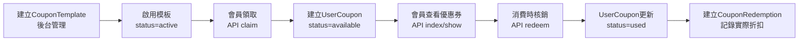

# Coupon 系統設計文件

## 核心模型

### CouponTemplate（優惠券規則／券種）

代表一個優惠券的模板定義，包含所有的規則設定。它不是某個會員手上的具體券，而是可以被多個會員領取的通用規則。

```text
夏日 9 折券
code: SUMMER10
type: PERCENTAGE
discount_percentage: 10
minimum_order_amount: 1000
max_discount_amount: 500
starts_at: 2026-06-01 00:00:00
expires_at: 2026-08-31 23:59:59
status: active
```

主要欄位：

- `name`：優惠券名稱
- `code`：優惠券代碼（會員用於領取）
- `type`：優惠券類型（FIXED_AMOUNT固定金額 / PERCENTAGE比例折扣 / FREE_SHIPPING免運費 / GIFT贈品）
- `discount_amount`：固定折抵金額（僅FIXED_AMOUNT使用）
- `discount_percentage`：折扣比例（僅PERCENTAGE使用）
- `max_discount_amount`：最高折抵金額上限
- `minimum_order_amount`：最低消費門檻
- `starts_at`：有效期開始時間
- `expires_at`：有效期結束時間
- `total_quantity`：發行總量
- `per_customer_limit`：單一客戶可領取數量上限
- `status`：狀態（active啟用 / inactive停用 / draft草稿）

### UserCoupon（會員持有的優惠券）

代表某一個會員實際領取並持有的優惠券實體。每當會員成功領取一個CouponTemplate，系統就會建立一張UserCoupon。

主要欄位：

- `customer_id`：關聯的會員
- `coupon_template_id`：關聯的優惠券模板
- `status`：狀態（available可用 / used已使用 / expired已過期 / cancelled已取消）
- `issued_at`：領取時間
- `used_at`：使用時間
- `expired_at`：過期時間

### CouponRedemption（優惠券核銷紀錄）

記錄一張UserCoupon實際被使用的詳細資訊，包含使用時的交易資訊與實際產生的折扣金額。

主要欄位：

- `user_coupon_id`：關聯的會員優惠券
- `customer_id`：使用的會員
- `reference`：本次核銷的唯一業務識別
- `order_reference`：外部訂單編號
- `discount_amount`：本次實際產生的折抵金額
- `redeemed_at`：核銷時間
- `created_by`：操作人ID

> **核心關係總結**
>
> ```
> CouponTemplate = 規則定義
> UserCoupon = 會員持有的具體券
> CouponRedemption = 實際使用記錄
> ```

---

## 資料關係

```text
CouponTemplate
    │
    │ 1:N (一個模板可以產生多張會員券)
    ▼
UserCoupon
    │
    │ 1:1 (一張會員券只會被核銷一次)
    ▼
CouponRedemption
```

---

## 完整生命週期



文字流程：

```
建立券種 → 發布啟用 → 會員領取 → 會員查看 → 使用核銷 → 保存記錄
```

---

## API 完整文件

### 會員領取優惠券

```http
POST /api/v1/customers/{customer}/coupons/claim
```

**請求Header**

```http
Authorization: Bearer {JWT}
X-Tenant-ID: {tenant_id}
Idempotency-Key: {unique_key}
```

**請求Body**

```json
{
    "code": "SUMMER10"
}
```

### 查詢會員所有優惠券

```http
GET /api/v1/customers/{customer}/coupons
```

### 查看單張優惠券詳情

```http
GET /api/v1/customers/{customer}/coupons/{userCoupon}
```

### 核銷優惠券

```http
POST /api/v1/customers/{customer}/coupons/{userCoupon}/redeem
```

**請求Body**

```json
{
    "reference": "RED-20260915-001",
    "order_reference": "ORD-20260915-001",
    "order_amount": 2000
}
```

---

## 錯誤情境

| 錯誤情境                        | HTTP狀態 | 錯誤訊息                           |
| ------------------------------- | -------- | ---------------------------------- |
| Customer不屬於目前租戶          | 404      | Customer not found                 |
| UserCoupon不屬於該Customer      | 404      | Coupon not found                   |
| Coupon code無效/不存在          | 400      | Invalid or expired coupon code     |
| 已達每人領取上限                | 400      | 您已達到此優惠券的領取上限         |
| 已領取過此優惠券                | 400      | 您已領取過此優惠券                 |
| 優惠券無法使用（已過期/已使用） | 400      | 優惠券無法使用，可能已過期或已使用 |
| 系統繁忙（鎖定逾時）            | 400      | 系統繁忙，請稍後再試               |

---

## 實作細節

### 併發控制

- 使用Redis分散式鎖防止並發超發
- 資料庫行鎖確保交易一致性
- 支援冪等性防止重複請求

### 租戶隔離

- 所有資源都有tenant_id約束
- API層級驗證租戶一致性
- 模型全域範圍自動過濾
